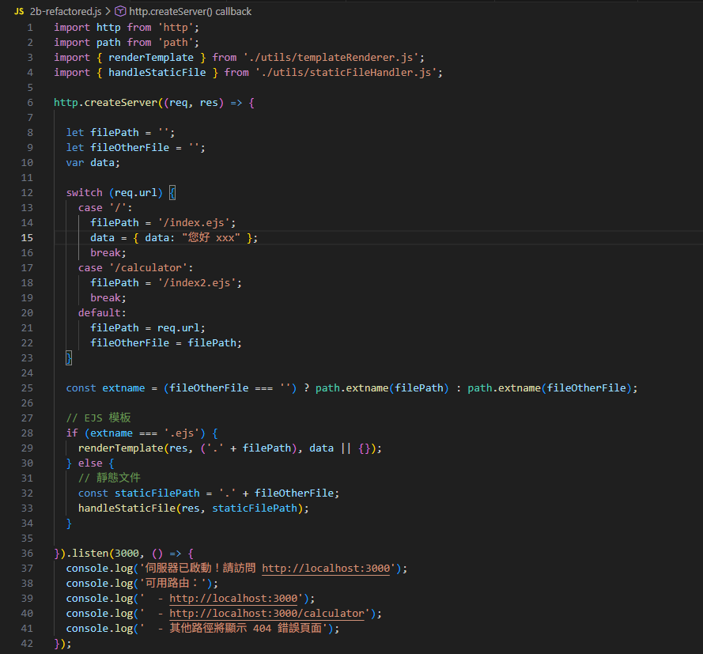
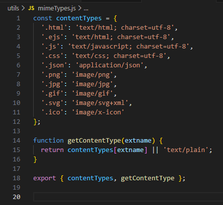
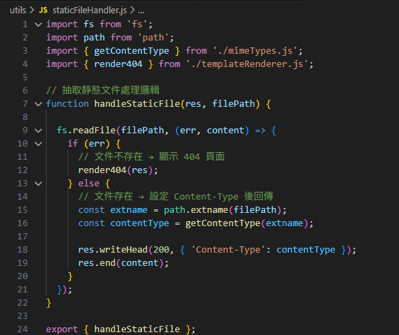
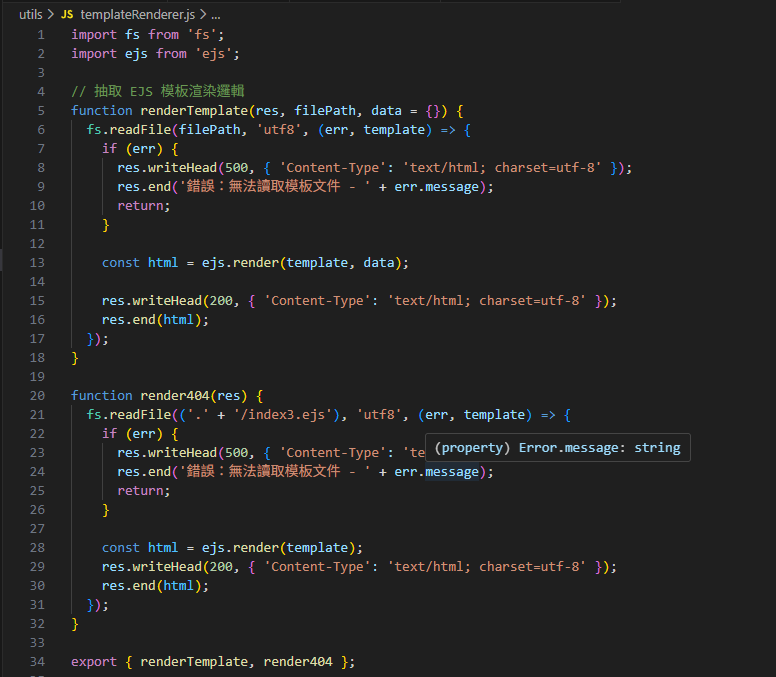
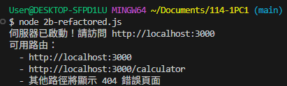
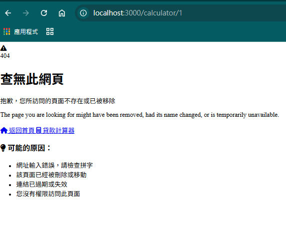

# 第2次隨堂題目-隨堂-QZ2
>
>學號：112111133
> 
>姓名：林凱翎
>

本份文件包含以下主題：(至少需下面兩項，若是有多者可以自行新增)
- [x] 說明內容

## 說明程式與內容

1. a.
主程式只負責路由判斷，透過 switch 判斷使用者請求的網址，再決定要渲染 EJS 頁面或交由靜態檔案處理模組，讓整體程式結構更清楚。
Ans: 

1. b.
這個檔案是把原本寫在主程式裡的 MIME 類型對照表抽出來，依照檔案副檔名回傳正確的 Content-Type，讓主程式不需要處理細節。
Ans:

1. c.
這個檔案專門處理 CSS、JavaScript 和圖片等靜態資源，會依照副檔名設定對應的 Content-Type，若檔案不存在則自動導向 404 頁面。
Ans:

2. a.
這個模組負責處理 EJS 模板的讀取與渲染，將重複的 fs.readFile 與 ejs.render 邏輯集中管理，也統一處理模板讀取失敗時的錯誤情況。
Ans:

2. b.

Ans:

2. c.

Ans:
    

2. d.
當請求的頁面或檔案不存在時，會透過這個函式顯示 404 錯誤頁面，避免在主程式中重複撰寫錯誤處理程式碼。
Ans:

